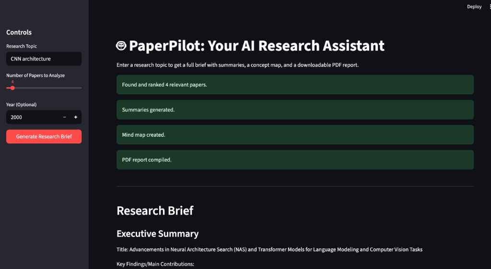

# 🤖 PaperPilot: Your AI Research Assistant

PaperPilot is a Streamlit web application that acts as an AI-powered research assistant. It takes a research topic, fetches recent papers from arXiv, summarizes them using a local LLM, and generates a comprehensive research brief, including a concept mind map and a downloadable PDF report.



## ✨ Core Features

-   **Topic-Based Search**: Find relevant academic papers from arXiv using any research query.
-   **Semantic Ranking**: Uses vector embeddings to rank papers by semantic similarity, not just keywords.
-   **Local LLM Summarization**: Leverages local models like Mistral or Llama 3 via Ollama for summarization, ensuring privacy and no API costs.
-   **Concept Mind Map**: Generates a visual mind map of key concepts extracted from the papers.
-   **Vector Storage**: Stores and searches retrieved papers in a local ChromaDB vector database for future queries.
-   **PDF Export**: Compiles all findings into a single, well-formatted PDF report with clickable source links.

## 🛠️ Tech Stack

-   **Orchestration & Logic**: Python, LangChain
-   **Web UI**: Streamlit
-   **Local LLM Server**: Ollama
-   **Vector Database**: ChromaDB
-   **Embeddings Model**: `SentenceTransformers`
-   **API**: `arxiv`
-   **PDF Generation**: `PyMuPDF`
-   **Visualization**: `networkx` & `matplotlib`

## 🚀 Getting Started

### Prerequisites

1.  **Python 3.10-3.12**: A stable version of Python is recommended. Issues were observed with Python 3.13 during development.
2.  **Ollama**: Download and install from [ollama.com](https://ollama.com/).
3.  **LLM Model**: Pull a model for Ollama to use. `mistral` is recommended for a balance of performance and resource usage.
    ```bash
    ollama pull mistral
    ```

### Installation

1.  Clone the repository (replace `YOUR_USERNAME` with your actual GitHub username):
    ```bash
    git clone [https://github.com/YOUR_USERNAME/PaperPilot.git](https://github.com/YOUR_USERNAME/PaperPilot.git)
    cd PaperPilot
    ```
2.  Create and activate a Python virtual environment:
    ```bash
    # For macOS/Linux
    python3 -m venv venv
    source venv/bin/activate

    # For Windows
    python -m venv venv
    venv\Scripts\activate
    ```
3.  Install the required packages from the `requirements.txt` file:
    ```bash
    pip install -r requirements.txt
    ```

### Running the Application

1.  Ensure the Ollama application is running in the background.
2.  Run the Streamlit app from your terminal using the following command. This method is robust against potential environment path conflicts.
    ```bash
    python -m streamlit run app.py
    ```
3.  Your web browser will automatically open a new tab with the application running locally.
